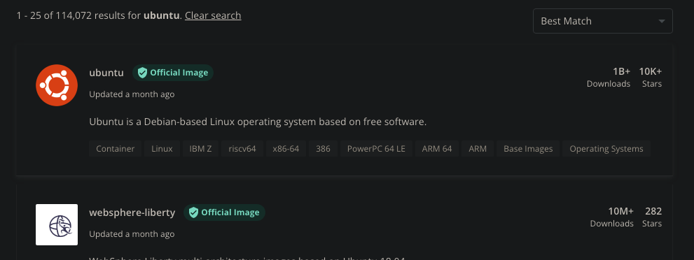
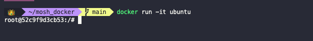
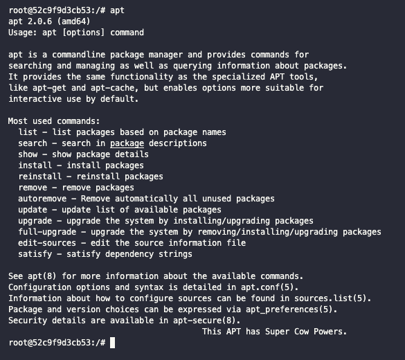
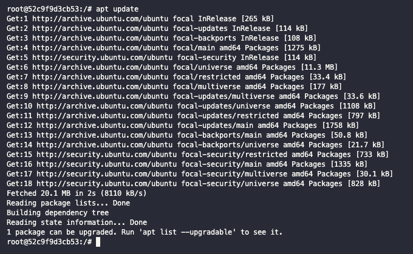
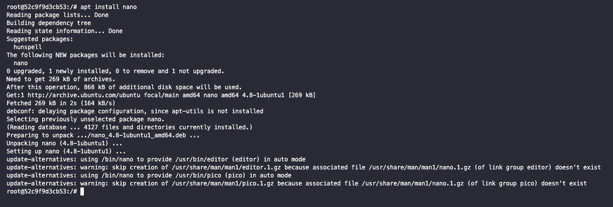
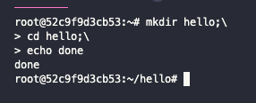
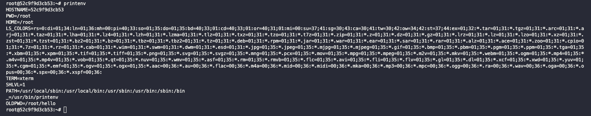
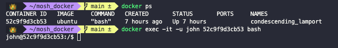

# Linux Command Line

## Linux distributions

Linux is an open-source OS. Therefore, many development communities have built their our custom versions of it. We call them *Linux distributions* or *Linux distros* for short. Some of the most popular are:

- Ubuntu (the one we'll use here)
- Debian
- Alpine
- Fedora
- CentOS

The commands are mostly the same for all of them.

## Running Linux

Head on to [DockerHub](https://hub.docker.com) and search for **ubuntu**.



Click on the image card and DockerHub will redirect you to its page. Here you can find the `docker pull` command to download this image into your computer. In this case that is simply `docker pull ubuntu`.


If instead you run `docker run ubuntu`, docker will first check if the image is locally available. If it is, it will run it. If it is not, it will pull it and then run it.


To check which containers are running we run:

``` shell
docker ps
```


The `ubuntu` image is not being used in any of our containers and is therefore not shown. If we want to display all containers (running or otherwise), we need to add the `-a` flag (which stands for *all*):

``` shell
docker ps -a
```


If we need to start a container in the interactive mode we need to add the `-it` flag, as well as the name of the image to run:

``` shell
docker run -it <image_name>
```



What we have done is to open a shell in the container. This shell is not waiting for our commands. The first part of the prompt says that we are currently logged in as the `root` user. Following that comes the name of the machine. So user `root` is at (`@`) machine ID `52c9f9d3cb53`. After the colon (`:`), the forward slash (`/`) represents where we are in the file system. In this case, we are at the root directory. Lastly, the pound sign (`#`) means that we have the highest levels of privileges. If we had logged in as a regular user we use see a currency sign (`$`).

Some commands that we can use are:

- `echo` to print something to the terminal
- `whoami` will display the user name
- `echo $0` will display the location of the shell program
- `ls` will display all directories
- `history` will display a list of all the commands that we've run
- with `!#` where `#` is a number from the history, we can re-run that command

## Managing packages

In Ubuntu we manage packages with `apt` (*Advances Package Tool*). If we run `apt` in the container, we can get a list of all the sub-commands that we can use



For example, we can use `apt list` to see the list of all available packages and their status.


If we don't see the package that we need in that list, we can run `apt update` and the list will be updated from a predefined list of sources.



To install a package we use.

``` shell
apt install <package_name>
```



Here we are installing `nano` which is a lightweight text editor for Ubuntu. To remove it we run:

``` shell
apt remove nano
```


## Linux file system

In Linux (just as with other OSs), files are organized in a tree. In Linux, everything is a file (including processes and directories). The root directory in Linux is just `/`. After that, standard directories include

- `bin` which includes all the binaries for that distro
- `boot` which includes all the files related to booting the system
- `dev` which is short for *devices* (not development) and includes all the files needed for accessing devices
- `etc` which is short for *editable text configurations* (not etcetera) and includes all the configuration files
- `home` which where all home directories (users) are stored
- `root` which is the home directory of the root user
- `lib` which is where software library dependencies are stored
- `var` which is short for *variable* and is where we store files that are update frequently (like logs)
- `proc` which is where we store files that represent running processes

``` txt
  /
  |_ bin
  |_ boot
  |_ dev
  |_ etc
  |_ home
  |_ root
  |_ lib
  |_ var
  |_ proc
```

## Navigating the file system

To navigate the files we need to use commands.

- `pwd` will *print working directory*
- `ls` will *list* the files in that directory. Some flags that we can add are:
  - `-1` for listing them one per row
  - `-l` for long listing (includes more details)
  - `<path>` will show the files in that path (without having to navigate to it)
- `cd` will *change directory*. We can use either relative or absolute paths:
  - relative paths are relative to the current working directory
  - absolute paths always start from the root `/`
  - `cd ..` will take us one level up in the tree
  - `cd ../..` will take us two levels up in the tree
  - `cd ~` will take us to the home directory of the current user

## Manipulating files and directories

- `mkdir` will create a new directory as a child of the current directory
- we use the `mv <current_location> <new_location>` to *move* a file or rename it
- `touch <file_name>` will create a new file
- `touch <file_name> ... <file_name>` will create all the files that we list
- `rm <file_name> ... <file_name>` will delete all the files that we list. We can also use patterns.
- `rm -r <directory_name>` will delete the directory and all its files

## Viewing and editing files

To view and edit files we can use `nano`. We open the file in nano by running.

``` shell
nano <file_name>
```

We ca ¿n now make changes to the file in the text editor. To exit a file we press `control + x`.

To see the content of a file we run:

``` shell
cat <file_name>
```

`cat` is short for *concatenate* and we can use it to combine files. When viewing files, `cat` is only useful for short files. For longer files we use:

``` shell
more <path/to/file>
```

When using `more` we can scroll down one page at a time by pressing the space bar, or one line at a time with the enter key We can exit by pressing `q`. But we can only scroll down. If we want to be able to scroll both up and down we run:

``` shell
less <path/to/file>
```

When using `less` we can scroll both up and down by using the arrows. The space bar, enter and `q` still work with `less`.

To look just at the head of a file we can use the `head` command followed by `-n #` where `#` is the number of lines.

``` shell
head -n 5 <file_name>
```

Similarly, we can use `tail` to see the last `n` lines.

``` shell
tail -n 5 <file_name>
```

## Redirection

Tow basic concepts in Linux are

- Standard input => keyboard
- Standard output => screen

But we can change the sources of either input or output. This is referred to as *redirection*. For example, `cat file1.txt` will print the content of `file1.txt` to the screen. But we can redirect the output by using the redirection operator (`>`) and send it to `file2.txt`.

Similarly, we can use the `<` sign to redirect the standard input.

## Searching for text

To search for text in a file we use the `grep` command, which stands for *global regular expression*. This search is case sensitive. We use it by supplying a string pattern and a file name.

``` shell
grep Hello file1.txt
```

We can remove case sensitivity with the `-i` flag.

``` shell
grep -i hello file1.txt
```

We can search in multiple files by supplying multiple file names or by supplying a file name pattern.

To search in directories, we can supply a directory name, or use `.` to refer to the current directory with the `-r` flag.

## Finding files and directories

To find files and directories we use the `find` command. If we run it without any arguments, it will list all files and directories in the current directory recursively. To search somewhere else, we need to supply a path.

If we only want to list directories we need to add the `-type` option with the value of `d`:

``` shell
find -type d
```

Likewise, we can use the `f` value for only getting files:

``` shell
find -type f
```

We can add patterns. For example, to search for all files who's names start with `f` we use:

``` shell
find -type f -name "f*"
```

To make the search case insensitive we use:

``` shell
find -type f -iname "f*"
```

## Chaining commands

We can chain multiple commands with semi-colons (`;`).

``` shell
mkdir test; cd test; echo done
```

If we want execution to stop at the first error, we use the *and* operator (`&&`).

``` shell
mkdir test && cd test && echo done
```

Likewise, we can use an *or* operator (`||`)

``` shell
mkdir test || echo "directory exists"
```

We can also use piping (`|`) to chain command.

``` shell
ls /bin | less
```

We can write multi-line commands by using a backslash (`\`) and pressing enter.



## Environment variables

We use environment variables to set or store settings for our application. To view the environment variables we run:

``` shell
printenv
```

The return value is a list of `key=value` pairs.



An important one to understand is `PATH`. Its value is the semi-colon separated list of paths that the OS will search for when requested to execute a program. If we only want to receive the value of one env variable (for example, `PATH`) we can use either of the following:

``` shell
printenv PATH
```

``` shell
echo $PATH
```

To set the value of an environment variable we use:

``` shell
export VAR_NAME=value
```

This variable will be set for the current session. If we want the variables to be available when re-starting, we need to include them in the `.bashrc` file. This is the user's personal startup file. We can achieve this with chaining:

``` shell
echo VAR_NAME=value >> .bashrc
```

The `>>` means append (as opposed to re-write the entire file). This changes will only be available starting from the next terminal session. If we need the `.bashrc` file to be re-loaded, we need to use:

``` shell
source ~/.bashrc
```

## Managing processes

A process is an instance of a running program. To see all the running processes we use:

``` shell
ps
```

To put a process in the background we use include an ampersand (`&`) after it. For example, the following will wait for 100 seconds in the background and still let us use the terminal.

``` shell
sleep 100 &
```

To kill a process we use the `kill` command and supply the process ID number.

## Managing users

To manage users we use the following commands:

- `useradd` to add a new user
- `usermod` to modify a user
- `userdel` to delete a user

To create a user called `john` with a home directory we run:

``` shell
useradd -m john
```

To see the user we run:

``` shell
cat /etc/passwd
```


We can see in the last line that the user `john` was added. This output prints all the users and their account information, separated by colons (`:`).

- first comes the user name
- the following `x` means that their password is store somewhere else
- the first `1000` is the user ID
- then comes the group ID (in this case also `1000`)
- next we can see the home directory of this user (in this case `/home/john`)
- lastly we see the shell program used when this user logs in (in this case `bin/sh`)

We can modify the shell program as follows:

``` shell
usermod -s /bin/bash john
```

The user passwords can be found in the `shadow` file:

``` shell
cat /etc/shadow
```

This file is only accessible to the root user, and passwords are stored in encrypted format.

To login is as a different user we open a new terminal window. First we need to run `docker ps` to get the container ID. Then we need to execute a bash session inside the container.

``` shell
docker exec -it -u USER_NAME CONTAINER_ID bash
```



To delete the user we run

``` shell
userdel USER_NAME
```

---

We can also create users with the newer `adduser` command. This command will use `useradd` under the hood, but is more verbose.

``` shell
adduser USER_NAME
```


Here we can see that `bob` was created and added to a user group of the same name. This is the default behavior. Now it is asking us to set the password. After that, it will ask us to enter additional information. This command is interactive, so we don't want to use it when building automated workflows.

## Managing groups

To manage groups we use the following commands:

- `groupadd` to add a new group
- `groupmod` to modify a group
- `groupdel` to delete a group

We use groups to manage access permissions.

We can checkout the groups with:

``` shell
cat /etc/group
```

To add a user to a group we use `-g` for the primary group or `-G` for secondary groups:

``` shell
usermod -G GROUP_NAME USER_NAME
```

To see the group that a user belongs to we use:

``` shell
groups USER_NAME
```
