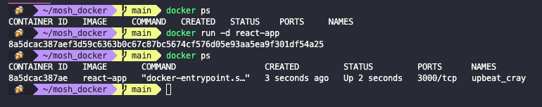
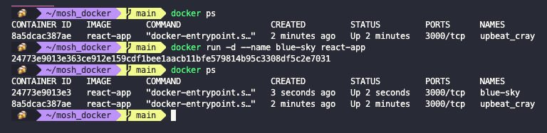
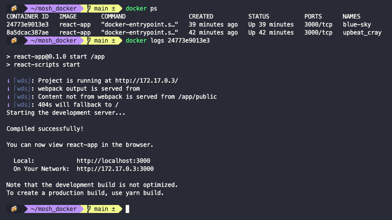
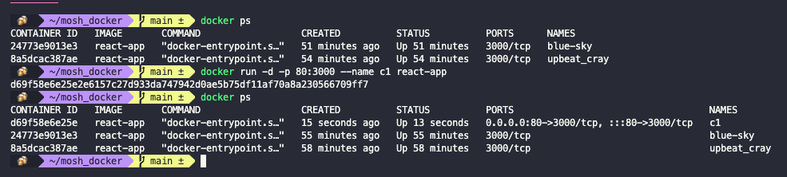

# Working with containers

- [Working with containers](#working-with-containers)
  - [Starting containers](#starting-containers)
  - [Viewing logs](#viewing-logs)
  - [Publishing ports](#publishing-ports)
  - [Executing commands in running containers](#executing-commands-in-running-containers)

## Starting containers

To see the running containers (which are just processes) we use:

``` shell
docker ps
```

To run a new container we use:

``` shell
docker run IMAGE
```

To run a container in the detached mode (in the background) we use:

``` shell
docker -d run IMAGE
```



Docker automatically assigns each container a random name. We can give it a name by running:

``` shell
docker run -d --name NAME IMAGE
```



## Viewing logs

To view the logs of a container we use:

``` shell
docker logs CONTAINER_ID
```



This command has some additional options.

- With the `-f` flag we can follow the log. This will allow us to see on the terminal whatever is written to the log.
- With the `-n` flag we can get just the last `n` lines of the log
- With the `-t` flag we can add timestamps to the log entries.

## Publishing ports

To send traffic from the container to the local host we need to publish a port. As you can see above, containers are not published by default (their value is `3000/tcp` because we specified that on the `Dockerfile`). To publish a port we use the `-p` flag to publish a port in on the host to a port in the container.

``` shell
docker run -d -p LOCAL_PORT:CONTAINER_PORT --name NAME IMAGE
```



## Executing commands in running containers

When we start a container it executes the default command that we specify in the `Dockerfile`. If we need to run commands on a running container we use:

``` shell
docker exec CONTAINER_NAME_OR_ID <command>
```

Commands need to be of the same OS as the base image (Linux commands for when using a Linux distro, Windows for when using Windows, and so on). This commands will be run in the default directory, which we specified in the `Dockerfile` with the `WORKDIR` instruction.

If we want to start a shell session in the container we run:

``` shell
docker exec -it CONTAINER_NAME_OR_ID sh
```

When we are done we can run the `exit` command, and that won't affect the state of the container.


