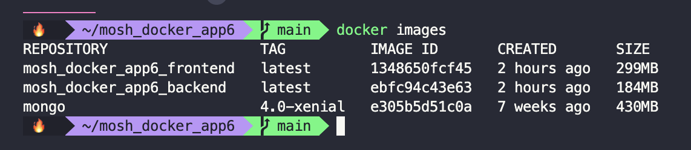
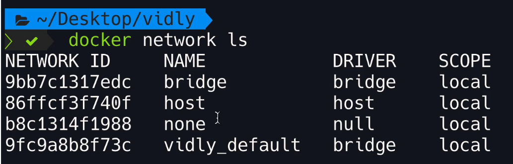
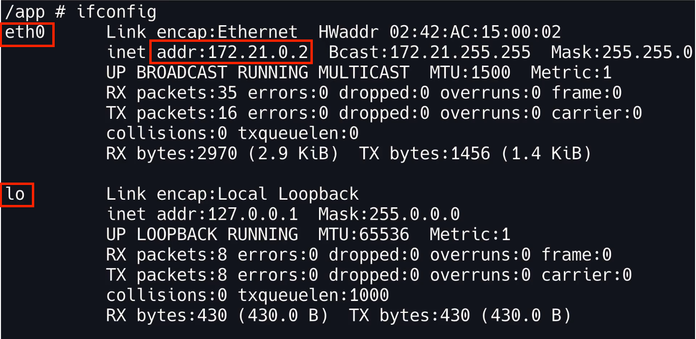

# Running multi-container applications

- [Running multi-container applications](#running-multi-container-applications)
  - [Installing Docker Compose](#installing-docker-compose)
  - [Cleaning up our workspace](#cleaning-up-our-workspace)
  - [Creating a compose file](#creating-a-compose-file)
    - [Docker compose version](#docker-compose-version)
    - [Services](#services)
    - [Builds and images](#builds-and-images)
    - [Mapping ports](#mapping-ports)
    - [Setting environment variables](#setting-environment-variables)
    - [Volumes](#volumes)
  - [Building images](#building-images)
  - [Starting and stopping the application](#starting-and-stopping-the-application)
  - [Docker networking](#docker-networking)
  - [Viewing logs](#viewing-logs)
  - [Publishing changes](#publishing-changes)
  - [Migrating the database](#migrating-the-database)
  - [Running tests](#running-tests)

## Installing Docker Compose

Docker Compose is shipped with Docker Desktop on MacOS and Windows. To verify that it has been installed run:

``` shell
docker-compose --version
```

## Cleaning up our workspace

To remove all Docker images run:

``` shell
docker container rm -f $(docker container ls -a -q)
docker image rm $(docker image ls -q)
```

The first command stops all containers, the second one removes all images.

## Creating a compose file

Docker compose will look for a file called `docker-compose.yml` in the root of the project.

### Docker compose version

The first property that we need to set is the `version`. This is not the version of our software, but the version of compose files. Each version of compose files has a compatibility relationship with the Docker engine that we are using. You can read all about them [here](https://docs.docker.com/compose/compose-file/compose-versioning/).

``` yaml
version: "3.8"
```

### Services

Next we need to define the `services` of our application. This will be an object with keys set to the name of the service (like `backend`, `frontend`, `db`, etc). The names that we give to the services is arbitrary.

``` yaml
version: "3.8"

services:
  frontend:
  backend:
  database:
```

``` yaml
version: "3.8"

services:
  web:
  api:
  db:
```

### Builds and images

Here we are defining services, telling Docker how to build images for each of them, and how to run them. Therefore, once we specified a service, the first thing we need to tell Docker is how to build the image for that service. For that we use the `build` key. Its value should be the path to the appropriate `Dockerfile`.

If for some particular service we don't have a `Dockerfile` but will just use the base image (for example, from DockerHub), then we need specify the `image` key and its value should be the name of the image.

``` yaml
version: "3.8"

services:
  web:
    build: ./frontend
  api:
    build: ./backend
  db:
    image: mongo:4.0-xenial
```

### Mapping ports

Next we need to map ports. To do so we start a new array called `ports`. Each mapping needs to be of the form `HOST_PORT:CONTAINER_PORT`.

``` yaml
version: "3.8"

services:
  web:
    build: ./frontend
    ports:
      - 3000:3000
  api:
    build: ./backend
    ports:
      - 3001:3001
  db:
    image: mongo:4.0-xenial
    ports:
      - 27017:27017
```

### Setting environment variables

If we need to define environment variables, we can do so with the `environment`. To it we can supply an array with values, or an array of objects. In the case of a data base URL the value should be `db-engine://host-name/db-name`.

Docker compose will generate the necessary hosts. Each service that we define will be a host whose name is equal to the name we give it in the `docker-compose.yml` file.

``` yaml
version: "3.8"

services:
  web:
    build: ./frontend
    ports:
      - 3000:3000
  api:
    build: ./backend
    ports:
      - 3001:3001
    environment:
      - DB_URL=mongodb://db/vidly
  db:
    image: mongo:4.0-xenial
    ports:
      - 27017:27017
```

``` yaml
version: "3.8"

services:
  web:
    build: ./frontend
    ports:
      - 3000:3000
  api:
    build: ./backend
    ports:
      - 3001:3001
    environment:
      DB_URL: mongodb://db/vidly
  db:
    image: mongo:4.0-xenial
    ports:
      - 27017:27017
```

### Volumes

To add a volume we use the `volumes` key. This can be an array of volumes. Each value of the array should be of the form `VOLUME_NAME:CONTAINER/DIRECTORY/PATH`.

``` yaml
version: "3.8"

services:
  web:
    build: ./frontend
    ports:
      - 3000:3000
  api:
    build: ./backend
    ports:
      - 3001:3001
    environment:
      DB_URL: mongodb://db/vidly
  db:
    image: mongo:4.0-xenial
    ports:
      - 27017:27017
    volumes:
      - vidly:/data/db
```

Since we have used a volume, we need to define it in the compose file. This requires a different object called `volumes`. Each volume that we use needs to be an object in the `volumes` object.

``` yaml
version: "3.8"

services:
  web:
    build: ./frontend
    ports:
      - 3000:3000
  api:
    build: ./backend
    ports:
      - 3001:3001
    environment:
      DB_URL: mongodb://db/vidly
  db:
    image: mongo:4.0-xenial
    ports:
      - 27017:27017
    volumes:
      - vidly:/data/db

volumes:
  vidly:
```

## Building images

All the operations that we saw for Docker related to images and containers are also available for Docker Compose. The difference is that these commands will impact all containers in our application. We can build all images with:

``` shell
docker-compose build
```



The names of the images are prefixed with the name of the directory.

If we want to avoid caching, we add the `--no-cache` option.

``` shell
docker-compose build --no-cache
```

## Starting and stopping the application

To start an application with Docker Compose we run:

``` shell
docker-compose up
```

If the images are available, Docker Compose is going to run them in containers. Otherwise, it will automatically build the images and then run them. Option to this command include:

- `--build` to force a build of the images before starting the application
- `-d` for detached mode (start containers in the background)

To see the running containers relevant for an application we run:

``` shell
docker-compose ps
```

This is difference from `docker ps` since this command will show all containers, regardless of whether they are relevant for this application or not.

To take down the containers and free up space we run:

``` shell
docker-compose down
```

This will stop and remove the containers, but the images will still be there.

## Docker networking

When we run our application with Docker Compose, Docker Compose will automatically create a network and add the containers to the network. With this, the containers will be able to talk to each other.

To see the Docker networks on our local machine we run:

``` shell
docker network ls
```



Every Docker installation has three networks: `bridge`, `host`, and `none`. For our application a new network will be created. Its name will be `PROJECT_NAME_default`. The driver for this network will be `bridge` on Linux or `Nat` on Windows. This network containers as many hosts as there are services declared on the `docker-compose.yml` file (in our example, three).

Docker comes with an embedded DNS server that contains the name and IP address of each container. Inside these containers there's a component called **DNS resolver**. This DNS resolver talks to the DNS server to find the IP address of the target container. The server returns the IP address and now the two containers can talk.

We can start an interactive shell session in the container with the root user and use `ifconfig` to see the IP address:

``` shell
docker exec -it -u root CONTAINER_ID sh
ifconfig
```



In this example we have two network adaptors: `eth0` (ethernet 0), and `lo`. The IP address for the `web` container is `172.21.0.2`.

## Viewing logs

We can see all the logs for all containers across this application in one place by running:

``` shell
docker-compose logs
```

The following options are available:

- `-f` to follow the logs
- `-t` to add timestamps
- `--tail="all"` to specify number of lines (`"all"` is the default value)

If we just want to see the logs for one container we use:

``` shell
docker logs CONTAINER_ID
```

## Publishing changes

To avoid having to rebuild our images every time we change our code while working we can map the directories of our project to the container directories. To do that we use the `volumes` array. Each element of the array needs to be a mapping of the form `PROJECT_DIRECTORY:CONTAINER_DIRECTORY`. The `PROJECT_DIRECTORY` is relative to the location of the location of the `docker-compose.yml` file. Make sure to have installed dependencies locally too before rebuilding the image.

``` yaml
version: "3.8"

services:
  web:
    build: ./frontend
    ports:
      - 3000:3000
    volumes:
      - ./frontend:/app
  api:
    build: ./backend
    ports:
      - 3001:3001
    environment:
      DB_URL: mongodb://db/vidly
    volumes:
      - ./backend:/app
  db:
    image: mongo:4.0-xenial
    ports:
      - 27017:27017
    volumes:
      - vidly:/data/db

volumes:
  vidly:
```

## Migrating the database

When we release our application we want the database to be in a particular shape with some data. This is called **database migration**. Each stack uses its own migration tools, but in the abstract they all do the same. We create a migration script that executes the migration. It includes two functions: `up` for upgrading the database, and `down` for downgrading the database.

In the `dockerfile` we use the `CMD` instruction to specify a command to run when running the container. But in the `docker-compose.yml` file we can use the `command` key (in the appropriate service) to override this `CMD` instruction. Since database migrations are part of the backend, in our example we'll include it in the `api` service.

There is a chance that the `db` service will not always be ready by the time the `api` service gets to executing the commands (because setting up DB engines usually takes some time). This is where we need to use a *waiting script*. You can read all about waiting for containers [here](https://docs.docker.com/compose/startup-order/). In this example we'll use [wait-for-it](https://github.com/vishnubob/wait-for-it). This is just a shell script. With this script we can wait for the DB engine (or any other service) to complete, before continuing with other services. The script needs to be included in the project directory. To use it, we just add the command `.wait-for HOST_NAME:PORT` (in this case `HOST_NAME` is `db` since we want the `api` to wait for the database engine to be set up). Once the specified port for the specified service is receiving traffic, the command will be executed.

``` yaml
version: "3.8"

services:
  web:
    build: ./frontend
    ports:
      - 3000:3000
    volumes:
      - ./frontend:/app
  api:
    build: ./backend
    ports:
      - 3001:3001
    environment:
      DB_URL: mongodb://db/vidly
    volumes:
      - ./backend:/app
    command: ./wait-for db:27017 && migrate-mongo up && npm start
  db:
    image: mongo:4.0-xenial
    ports:
      - 27017:27017
    volumes:
      - vidly:/data/db

volumes:
  vidly:
```

If the command is too long, we can create an `entrypoint.sh` script to make our `docker-compose.yml` file more readable.

``` shell
#!/bin/sh

echo "Waiting for MongoDB to start..."
./wait-for db:27017 

echo "Migrating the databse..."
npm run db:up 

echo "Starting the server..."
npm start 
```

Now our `docker-compose.yml` can be simplified to:

``` yaml
version: "3.8"

services:
  web:
    build: ./frontend
    ports:
      - 3000:3000
    volumes:
      - ./frontend:/app
  api:
    build: ./backend
    ports:
      - 3001:3001
    environment:
      DB_URL: mongodb://db/vidly
    volumes:
      - ./backend:/app
    command: ./docker-entrypoint.sh
  db:
    image: mongo:4.0-xenial
    ports:
      - 27017:27017
    volumes:
      - vidly:/data/db

volumes:
  vidly:
```

## Running tests

To run the tests we create a new service in the `docker-compose.yml` file.

For this service we do not want to build a new image, but rather use the existing image form that service. Therefore, instead of the `build` key we use the `image` key and supply to it the appropriate image. Since said image is being built by Docker Compose, its name will be `<project-name>_<service-name>`. We don't need to map `ports` for this service. We do want to keep the `volumes` so that if we make any changes to the application, these are available to the tests. The `command` for this service needs to be the test running command (in this example we are using `npm test`).

``` yaml
version: "3.8"

services:
  web:
    build: ./frontend
    ports:
      - 3000:3000
    volumes:
      - ./frontend:/app
  web-tests:
    image: vidly_web
    volumes:
      - ./frontend:/app
    command: npm test
  api:
    build: ./backend
    ports:
      - 3001:3001
    environment:
      DB_URL: mongodb://db/vidly
    volumes:
      - ./backend:/app
    command: ./docker-entrypoint.sh
  api-tests:
    image: vidly_api
    environment:
      DB_URL: mongodb://db/vidly
    volumes:
      - ./backend:/app
    command: npm test
  db:
    image: mongo:4.0-xenial
    ports:
      - 27017:27017
    volumes:
      - vidly:/data/db

volumes:
  vidly:
```

This way of running tests can sometimes be a little bit slow.
